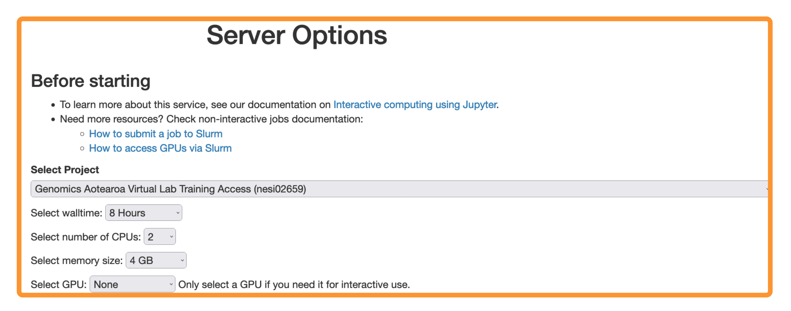

{width="300"}

# 

<!--- check -->

| **Lesson**                                     | **Overview**                                                  |
| :--------------------------------------------- | :------------------------------------------------------------ |
| 1. [Setting up Git](./2_summary_setup.md)      | Configuring Git for use                                       |
| 2. [Creating a repository](./3_create_repo.md) | Creating a local git repository                               |
| 3. [Tracking Changes](./4_tracking_changes.md) | Adding and commiting files                                    |
| 4. [Exploring History](./5_history.md)         | Comparing various versions of tracked files                   |
| 5. [Ignoring Things](./6_ignoring_things.md)   | Excluding specific files and directories from version control |
| 6. [Remotes in Github](./7_remotes.md)         | Pushing and pulling from a remote repository                  |
|                                                |

---

!!! copyright "Attribution Notice"

    * This workshop material is heavily inspired by :
        1. [Software Carpentry Introduction to Version Control with Git](https://swcarpentry.github.io/git-novice/) and
        2. [Happy Git with R](https://happygitwithr.com)

---

<!-- !!! key "License"

    Genomics Aotearoa / New Zealand eScience Infrastructure "Intro to Git" is licensed under the **GNU General Public License v3.0, 29 June 2007** . ([Follow this link for more information](https://github.com/GenomicsAotearoa/shell-for-bioinformatics/blob/main/LICENSE))

--- -->

!!! screwdriver-wrench "Setup"

    - If possible, we do recommend using the **Remote** option over **Local**  ( Especially for *Windows* hosts). This will eliminate  the need to install any additional applications

    - **Remote** option will require an existing NeSI Account

    ### Remote

    ??? jupyter "Log into NeSI Mahuika Jupyter Service"

        1. Follow [https://jupyter.nesi.org.nz/hub/login](https://jupyter.nesi.org.nz/hub/login)
        2. 
Enter NeSI username, HPC password and 6 digit second factor token 

        3. 
Choose server options as below
         >>make sure to choose the correct project code `nesi02659`, number of CPUs `CPUs=2`, memory `4 GB` prior to pressing {width="40"}  button.

         

    ### Local  :warning:

    ??? circle-info "Local host setup - Windows, MacOS & Linux"

        === "Windows Hosts"

              * Git for Windows from [https://git-scm.com/download/win](https://git-scm.com/download/win)

        === "MacOS"

              * Native terminal client is sufficient.
              * It might not comes with `wget` download data via command line (can be installed with `$ brew install wget`)
              * However, it is not required as we provide a direct link to download data in .zip format

        === "Linux"

              * Native terminal client is sufficient.
